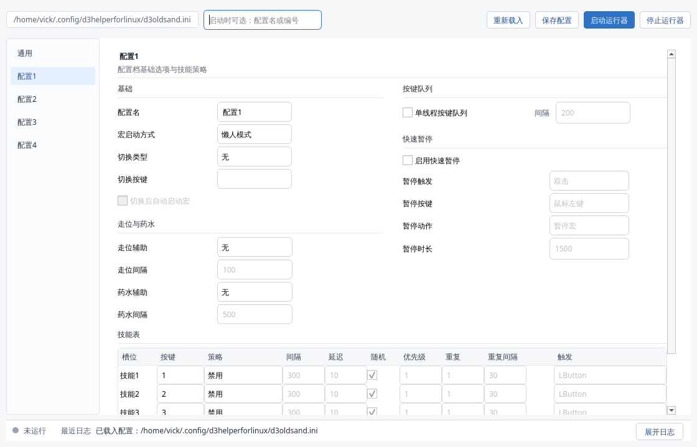

# D3keyHelperForLinux

[](./LICENSE)

`D3keyHelperForLinux` 是基于原项目 **D3keyHelper** 改造的 Linux 原生版本，面向 **Diablo III + Steam + Proton** 使用场景，目标是在 **Arch Linux / KDE / X11 / XWayland** 环境下，提供尽量接近原版 AHK 的战斗宏与助手体验。

这个仓库是一个**可单独发布的独立项目**：源码、GUI、测试、打包脚本、截图资源和许可证都在当前目录内，不依赖父仓库。

## 致谢与许可证

本项目基于原作者 **Weijie Huang** 的 **D3keyHelper** 移植而来。感谢原作者公开原始项目、配置格式和功能设计。

本项目继续遵循 **MIT License**。发布、分发或二次修改时，请保留原作者版权声明与许可证文本，不要移除 `LICENSE` 中的内容。

## 适用场景

当前最推荐的使用环境：

1. **Arch Linux / 其他 Linux 发行版**
2. **Steam + Proton** 启动战网 / Diablo III
3. **X11**，或 **Wayland 下运行 XWayland 游戏窗口**
4. KDE 桌面下也支持一部分 Wayland 图像识别链路

当前完整度排序：

1. **X11 / XWayland：最完整、最稳定**
2. **KDE Wayland + XWayland 游戏窗口：可用**
3. **纯 Wayland 原生全链路：仍有限制**

## 主要功能

### 战斗宏

1. 图形界面编辑 `d3oldsand.ini`
2. 懒人模式 / 仅按住时 / 仅按一次
3. 技能策略：
   - 按住不放
   - 连点
   - 保持 Buff
   - 按键触发
4. 延迟、随机延迟、优先级、重复发送
5. 单线程按键队列
6. 强制站立、强制移动、药水辅助、保持药水 CD
7. 快速暂停、智能暂停
8. 快速切换配置
9. 配置变更自动保存，运行器自动重启

### 一键助手

1. 赌博助手
2. 拾取助手
3. 分解助手
4. 重铸助手
5. 升级助手
6. 转化助手
7. 丢装 / 存仓助手

### Linux / Proton 适配

1. Steam/Proton 下的 Diablo III 窗口识别
2. 对标题缺失、乱码标题的兼容
3. 通过窗口类名和进程命令行识别 `Diablo III64.exe`
4. safezone 兼容原版默认值 `61,62,63`
5. 保留原版配置兼容项：`sendmode`、`enablesoundplay`、`compactmode`

## 界面截图

### 主界面


### 紧凑界面



### 配置说明图


### Safezone 编号示意


## 快速开始

### 1. 安装依赖

```bash
python -m venv .venv
source .venv/bin/activate
pip install -r requirements.txt
```

如果你是 Arch Linux，通常至少需要：

```bash
sudo pacman -S python python-pip
```

### 2. 生成默认配置

```bash
python d3keyhelper_linux.py --init-config
```

### 3. 打开 GUI

```bash
python d3keyhelper_linux.py --gui
```

### 4. 或直接启动运行器

```bash
python d3keyhelper_linux.py
```

## 常用命令

```bash
# 图形界面
python d3keyhelper_linux.py --gui

# 初始化配置
python d3keyhelper_linux.py --init-config

# 列出配置
python d3keyhelper_linux.py --list-profiles

# 指定配置启动
python d3keyhelper_linux.py --profile 配置1

# 强制使用 KDE Wayland 截图后端
python d3keyhelper_linux.py --capture-backend kde-wayland

# 临时忽略 d3only，只对当前前台窗口发按键
python d3keyhelper_linux.py --any-window
```

## Steam / Proton 使用建议

如果你是通过 **Steam -> Proton -> 战网 -> Diablo III** 启动游戏，建议优先这样使用：

1. 游戏尽量跑在 **X11** 或 **XWayland** 窗口下
2. GUI 里开启 `d3only`
3. 助手热键优先用：
   - 键盘按键
   - 鼠标侧键
   - 滚轮
4. 如果窗口标题异常，当前版本也会尝试从 Proton 进程命令行识别游戏

如果你曾经遇到中文标题识别问题，可以尝试为 Steam/Proton 设置统一 locale，例如：

```bash
LANG=zh_CN.UTF-8 %command%
```

## Safezone 说明

`safezone` 表示一键助手不会处理的背包格子。

格式是 **1-60 的格子编号，英文逗号分隔**，例如：

```ini
safezone=1,2,3,10
```

特别说明：

原版 AHK 默认使用：

```ini
safezone=61,62,63
```

这三个格子实际上并不存在，只是原作者用来提示 safezone 配置格式的**历史默认占位值**。当前 Linux GUI 已兼容这一行为，会显示为：

**未设置（沿用原版默认值）**

不会再误报为格式错误。

## AppImage 打包

### 构建

```bash
./build_appimage.sh
```

### 产物路径

```bash
build/appimage/D3keyHelper-Linux-x86_64.AppImage
```

### 运行

```bash
chmod +x build/appimage/D3keyHelper-Linux-x86_64.AppImage
./build/appimage/D3keyHelper-Linux-x86_64.AppImage
```

## 测试

```bash
python -m unittest discover -s tests
```

## 目录结构

```text
.
├── d3keyhelper_linux.py
├── d3keyhelper_linux_gui.py
├── build_appimage.sh
├── requirements.txt
├── packaging/
├── tests/
├── LICENSE
└── README.md
```

