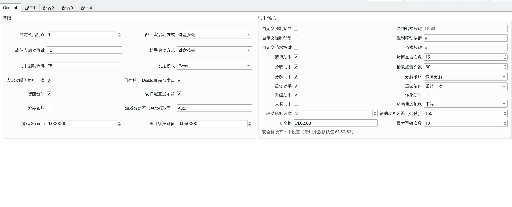

# D3keyHelperForLinux

[](https://github.com/vickwv/D3keyHelperForLinux/actions/workflows/build-appimage.yml)
[](./LICENSE)

**语言:** [English](./README.md) | 简体中文

`D3keyHelperForLinux` 是原版 **[D3keyHelper](https://github.com/WeijieH/D3keyHelper)** 的 Linux 移植版，用于在 **Diablo III** 中使用辅助热键和可重复的战斗按键动作。项目尽量保持原版 `d3oldsand.ini` 配置兼容，同时加入 Linux 原生按键发送、窗口识别、截图处理和 Qt 图形界面。

本项目只围绕 Diablo III 的按键循环、城镇助手、背包处理流程和原版配置兼容来设计。它不是通用自动化框架，也不是游戏修改器。

## 致谢与许可证

本项目基于原作者 **Weijie Huang** 的 **D3keyHelper** 移植而来：

<https://github.com/WeijieH/D3keyHelper>

感谢原作者公开原始项目、配置格式和功能设计，这些内容让 Linux 移植成为可能。

本项目继续遵循 **MIT License**。发布、分发或二次修改时，请保留原作者版权声明与 [LICENSE](./LICENSE) 中的许可证文本。

## 当前状态

推荐环境：

1. **X11 Linux 桌面**
2. **Wayland 会话下，以 XWayland 窗口运行 Diablo III**
3. **Steam + Proton + Battle.net + Diablo III**
4. **KDE Plasma**，尤其是使用 KDE 侧截图路径时

支持完整度：

1. **X11 / XWayland：最完整、最稳定**
2. **KDE Wayland + XWayland 游戏窗口：可用**
3. **纯 Wayland 原生全链路：仍有限制**

近期项目重点：

1. Qt GUI 支持配置编辑、运行器控制、语言切换和运行日志。
2. 刷新 Fluent 风格界面、左侧导航、配置页和应用图标。
3. Linux 原生按键发送、鼠标操作、窗口匹配和截图后端。
4. 兼容原版 `d3oldsand.ini` 配置读取与保存。
5. 支持 AppImage 打包和 GitHub Actions 自动构建。

## 界面截图

### 主界面



### Safezone 编号示意


## 快速开始

### 1. 安装依赖

```bash
python -m venv .venv
source .venv/bin/activate
pip install -r requirements.txt
```

如果你是 Arch Linux，常见基础安装方式：

```bash
sudo pacman -S python python-pip
```

### 2. 生成默认配置

```bash
python d3keyhelper_linux.py --init-config
```

默认配置文件路径：

```bash
~/.config/d3helperforlinux/d3oldsand.ini
```

如果设置了 `XDG_CONFIG_HOME`，则会创建到：

```bash
$XDG_CONFIG_HOME/d3helperforlinux/d3oldsand.ini
```

### 3. 启动 GUI

```bash
python d3keyhelper_linux.py --gui
```

GUI 是推荐入口，可以编辑通用选项、配置页、技能策略、助手设置和运行器状态，不需要手动改 ini。

GUI 首次启动会检测当前系统语言：

1. `en*` 使用 English
2. `zh_TW` / `zh_HK` / `zh-Hant` 使用繁體中文
3. `zh*` 使用简体中文
4. 其他语言默认使用简体中文

也可以在顶部工具栏的语言下拉框中手动切换，标识为 `简 / EN / 繁`。手动选择会写入 `d3oldsand.ini`，以后启动优先使用配置里的语言。

临时覆盖语言可以使用 `D3HELPER_LANG`：

```bash
# 简体中文
D3HELPER_LANG=zh python d3keyhelper_linux.py --gui

# English
D3HELPER_LANG=en python d3keyhelper_linux.py --gui

# 繁體中文
D3HELPER_LANG=zh_TW python d3keyhelper_linux.py --gui
```

也可以使用 `zh-hant`、`zh_HK`、`tw`、`hk` 这类繁中别名。

### 4. 或直接启动运行器

```bash
python d3keyhelper_linux.py
```

## 常用命令

```bash
# 图形界面
python d3keyhelper_linux.py --gui

# 创建默认配置
python d3keyhelper_linux.py --init-config

# 列出配置
python d3keyhelper_linux.py --list-profiles

# 按配置名启动
python d3keyhelper_linux.py --profile 配置1

# 强制使用 KDE Wayland 截图后端
python d3keyhelper_linux.py --capture-backend kde-wayland

# 临时忽略 d3only，只对当前前台窗口发按键
python d3keyhelper_linux.py --any-window
```

## 功能

### 战斗宏运行器

运行器负责在游戏中执行按键循环和辅助逻辑。配置保存为原版兼容的 `d3oldsand.ini`。

1. 支持懒人模式、按住运行、单次触发。
2. 支持 6 个技能位的独立策略：
   - 按住不放
   - 连点
   - 保持 Buff
   - 按键触发
3. 支持延迟、随机延迟、优先级、重复发送。
4. 支持强制站立、强制移动、药水辅助、保持药水 CD。
5. 支持快速暂停、智能暂停和快速切换配置。
6. 配置变更后自动保存，运行中修改关键配置时自动重启运行器。

### 图形界面

1. 以结构化表单编辑通用选项、配置页和技能策略。
2. 左侧导航显示通用页和所有配置页。
3. 顶部工具栏显示当前活动配置、语言切换和启动/停止运行器入口。
4. 底部状态和日志区域显示配置路径、运行状态和最近操作。
5. 保留原版配置字段，尽量避免破坏已有配置。

### 一键助手

这些功能主要面向城镇整理、背包处理和批量材料操作：

1. 赌博助手
2. 拾取助手
3. 分解助手
4. 重铸助手
5. 升级稀有物品助手
6. 转化材料助手
7. 丢装 / 存仓助手

### Linux / Proton 兼容

1. 支持 Steam/Proton 下的 Diablo III 窗口识别。
2. 兼容空标题、乱码标题。
3. 可通过进程命令行识别 `Diablo III64.exe`。
4. 兼容原版 safezone 默认占位值 `61,62,63`。
5. 保留原版配置兼容项：`sendmode`、`enablesoundplay`、`compactmode`。

## Steam / Proton 使用建议

如果你是通过 **Steam -> Proton -> 战网 -> Diablo III** 启动游戏，最推荐的方式是：

1. 尽量让游戏跑在 **X11** 或 **XWayland** 窗口里。
2. 在 GUI 里保持 `d3only` 开启。
3. 助手热键优先使用：
   - 键盘按键
   - 鼠标侧键
   - 滚轮
4. 如果游戏窗口标题为空或乱码，项目也会回退到 Proton 进程命令行识别。

如果你曾经遇到中文标题识别问题，可以尝试为游戏统一 locale：

```bash
LANG=zh_CN.UTF-8 %command%
```

## Safezone 说明

`safezone` 用来定义一键助手不会处理的背包格子。

常规格式：

```ini
safezone=1,2,3,10
```

特殊情况：

```ini
safezone=61,62,63
```

这三个编号实际上并不存在，只是原版 AHK 用来提示 safezone 配置格式的历史占位值。当前 Linux 版会把它识别成：

**未设置（沿用原版默认值）**

而不是把它报成格式错误。

## AppImage 打包

### 本地构建

```bash
./build_appimage.sh
```

### 产物

```bash
build/appimage/D3keyHelper-Linux-x86_64.AppImage
```

### 运行

```bash
chmod +x build/appimage/D3keyHelper-Linux-x86_64.AppImage
./build/appimage/D3keyHelper-Linux-x86_64.AppImage
```

## GitHub Actions 自动构建

仓库自带 GitHub Actions 工作流，会自动：

1. 运行测试
2. 构建 AppImage
3. 上传 AppImage 作为 workflow artifact
4. 当推送 `v1.0.6` 这类 tag 时，把 AppImage 附加到 GitHub Release

发布说明保存在 [.github/release-notes](./.github/release-notes) 目录。

## 测试

```bash
python -m unittest discover -s tests
```

## 仓库结构

```text
.
├── config_io.py
├── config_schema.py
├── capture.py
├── vision.py
├── enums.py
├── runner_events.py
├── d3keyhelper_linux.py
├── d3keyhelper_linux_gui.py
├── gui_i18n.py
├── gui_widgets.py
├── gui_profile_page.py
├── build_appimage.sh
├── requirements.txt
├── docs/
├── packaging/
├── tests/
├── LICENSE
├── README.md
└── README.zh-CN.md
```
