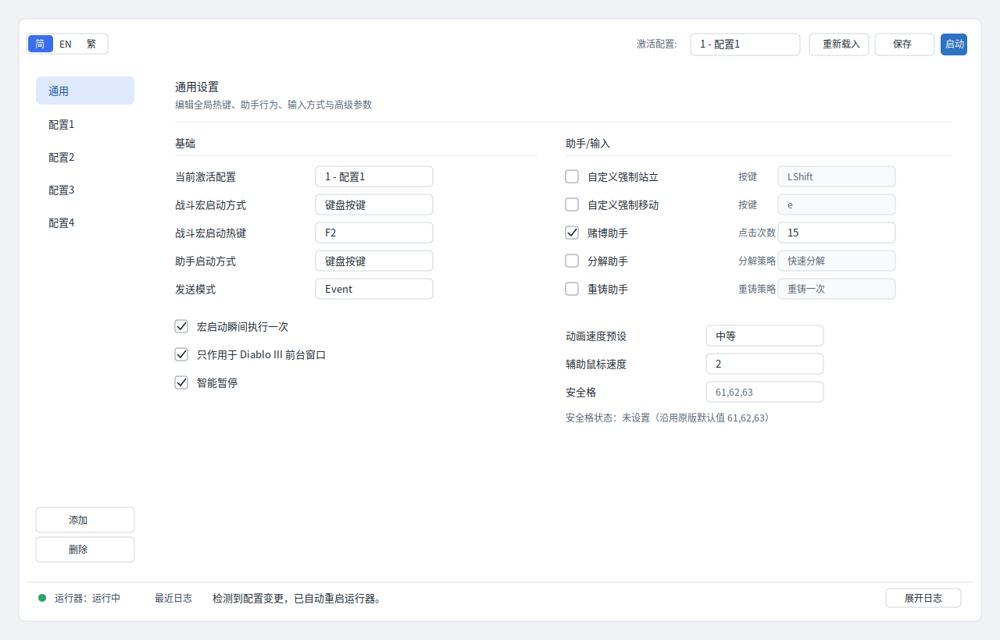

# D3keyHelper Linux UI 设计方案

本文档定义下一版 GUI 的设计方向。目标不是把界面做得“炫”，而是做成一个长期可维护、低干扰、密度合适、Linux 桌面上不突兀的配置工具。

## 预览图



## 设计结论

本项目应继续使用 **PySide6 / Qt Widgets**，但界面风格从“网页卡片式表单”改为 **紧凑型桌面设置面板**。

推荐路线：

1. 保留 Qt Widgets，不切换 GTK、Qt Quick/QML 或 WebView。
2. 使用轻量主题库做基础视觉统一，优先试验 `qdarktheme` 的浅色主题。
3. 大幅减少自定义 QSS，只保留尺寸、间距、主按钮、状态提示等必要修饰。
4. 布局以设置工具为准：左侧导航、右侧设置页、底部状态栏、日志可展开。
5. 技能配置改为表格，通用配置改为紧凑两列设置项。

不推荐继续沿用当前“大输入框 + GroupBox 卡片 + 大面积留白”的方向。它会让工具看起来像半成品网页后台，而不是成熟的桌面工具。

## 视觉目标

界面应满足这些关键词：

- **紧凑**：一屏能看到主要配置，不依赖频繁滚动。
- **克制**：控件不抢内容注意力，颜色只用于状态和主要动作。
- **稳定**：布局不因文本长度、禁用状态、日志变化而明显跳动。
- **清楚**：用户能快速理解哪些是全局配置，哪些是当前配置档。
- **不累人**：低对比背景、清晰边界、足够行距，但避免大块空白。

视觉参考可以接近：

- KDE System Settings 的密集设置页
- GNOME Tweaks 的简单配置页
- VS Code Settings 的左侧导航与右侧设置内容
- 传统 Windows 工具软件的效率，但用更干净的浅色主题

## 推荐主题方案

### 首选：qdarktheme 浅色主题

优先尝试：

```python
import qdarktheme

qdarktheme.setup_theme(
    "light",
    corner_shape="sharp",
    custom_colors={
        "primary": "#2f6feb",
    },
)
```

使用原则：

- `corner_shape="sharp"`，避免大圆角带来的网页感。
- 主题只作为基础，不再叠加大面积自定义 QSS。
- 主按钮、危险状态、运行状态可以用少量额外 QSS 补足。
- 如果依赖兼容性不好，再退回 Qt 原生 Fusion + 项目内小型 QSS。

### 备选：qt-material

如果 `qdarktheme` 在当前 Python / PySide6 环境下不稳定，可以试 `qt-material`：

```python
from qt_material import apply_stylesheet

apply_stylesheet(
    app,
    theme="light_blue.xml",
    invert_secondary=True,
    extra={
        "density_scale": "-2",
        "font_size": "12px",
    },
)
```

使用 `qt-material` 时必须降低密度，否则 Material 风格会继续显得偏大。

### 不推荐

- **PySide6-Fluent-Widgets / QFluentWidgets**：现代感强，但默认控件偏大，风格偏 Windows 11，许可证和分发也更复杂。
- **Qt Quick / QML**：能做漂亮，但对本项目过重，会增加维护成本。
- **WebView / 前端重写**：对一个本地配置工具没有必要。

## 全局布局

主窗口采用四区结构：

```text
┌──────────────────────────────────────────────────────────────┐
│ 顶部工具栏：配置路径 / 配置档输入 / 重新载入 / 保存 / 启停       │
├──────────────┬───────────────────────────────────────────────┤
│ 左侧导航      │ 当前页面内容                                    │
│ 通用          │                                               │
│ 配置1         │                                               │
│ 配置2         │                                               │
│ 配置3         │                                               │
│ 配置4         │                                               │
├──────────────┴───────────────────────────────────────────────┤
│ 底部状态栏：运行状态 / 当前布局 / 最近日志 / 展开日志按钮        │
└──────────────────────────────────────────────────────────────┘
```

默认窗口建议：

- 默认尺寸：`1120 x 720`
- 最小尺寸：`960 x 620`
- 左侧导航宽度：`144-160px`
- 顶部工具栏高度：约 `44px`
- 底部状态栏高度：约 `30-34px`
- 日志默认收起，展开后高度 `120-160px`

不要默认使用 `1600 x 950`。这会让界面在普通屏幕上显得笨重，也会放大留白问题。

## 顶部工具栏

顶部工具栏只放高频动作：

- 配置文件路径，使用中间省略。
- 启动时配置档输入框。
- `重新载入`
- `保存配置`
- `启动运行器`
- `停止运行器`

规格：

- 工具栏左右边距：`10-12px`
- 控件高度：`28px`
- 按钮最小宽度：`72-92px`
- 配置路径宽度：`220-320px`
- 配置档输入宽度：`180-220px`
- 主按钮只给 `启动运行器`，使用蓝色实心。
- 其他按钮使用普通浅色按钮。

工具栏不应出现大字号、厚边框或大圆角。

## 左侧导航

左侧导航替代顶部 Tab。当前截图中左侧导航方向是对的，但需要更克制。

规格：

- 宽度：`144-160px`
- 背景：接近窗口背景，略深或略浅即可。
- 选中项：浅蓝背景 + 蓝色文字，不能太亮。
- 项高度：`34-38px`
- 项内边距：左右 `12px`
- 圆角：`4px` 或无圆角。

导航项：

- `通用`
- `配置1`
- `配置2`
- `配置3`
- `配置4`

后续如果支持更多配置，可滚动，但滚动条只在需要时出现。

## 内容区

内容区不要再使用大块 `QGroupBox` 卡片。推荐使用“标题 + 分隔线 + 设置项”的结构。

示例：

```text
基础
────────────────────────────────────────
当前激活配置        [ 1              ]
战斗宏启动方式      [ 键盘按键       ]
战斗宏启动热键      [ F2             ]

助手与输入
────────────────────────────────────────
助手启动方式        [ 键盘按键       ]
助手启动热键        [ F5             ]
发送模式            [ Event          ]
```

分组规则：

- 标题字号比正文略大或加粗即可。
- 分隔线使用很浅的灰色。
- 分组之间垂直间距 `14-18px`。
- 不要给每个分组加厚边框、白色卡片、大圆角。

## 表单密度

推荐尺寸：

- 基础字体：`12px` 或系统默认小字号。
- Label 宽度：`112-128px`
- 输入框高度：`26-28px`
- 输入框宽度：普通字段 `140-180px`，长文本字段 `220-320px`
- 行高：`30-34px`
- 行间距：`4-6px`
- 两列之间间距：`28-40px`

不推荐：

- 输入框高度 `34px` 以上。
- Label 固定宽 `146px` 以上。
- 所有字段统一 `240px` 宽。
- 一页里出现大量空白区域。

## 通用页布局

通用页分为两列，不再把内容挤在左上角。

左列：

- 基础启动设置
- 运行行为
- 游戏识别

右列：

- 助手开关
- 安全格
- 动画速度
- 自定义按键

建议分组：

1. `基础`
   - 当前激活配置
   - 战斗宏启动方式
   - 战斗宏启动热键
   - 宏启动瞬间执行一次
   - 只作用于 Diablo III 前台窗口
   - 智能暂停
   - 切换配置提示音

2. `助手`
   - 助手启动方式
   - 助手启动热键
   - 赌博助手
   - 拾取助手
   - 分解助手
   - 重铸助手
   - 升级助手
   - 转化助手
   - 丢装助手

3. `输入`
   - 发送模式
   - 自定义强制站立
   - 强制站立按键
   - 自定义强制移动
   - 强制移动按键
   - 自定义药水按键
   - 药水按键

4. `高级`
   - 游戏分辨率
   - 游戏 Gamma
   - Buff 续按阈值
   - 动画速度预设
   - 辅助鼠标速度
   - 辅助动画延迟
   - 安全格
   - 最大重铸次数

开关类设置可以使用紧凑复选框，也可以在后续封装为小型 switch。短期内优先用复选框，避免引入重组件库。

## 配置页布局

每个配置页分成两部分：

1. 上方：配置档基础设置。
2. 下方：技能表格。

配置档基础设置使用两列紧凑表单：

- 配置名
- 快速切换类型
- 快速切换按键
- 切换后自动启动宏
- 宏启动方式
- 走位辅助
- 走位间隔
- 药水辅助
- 药水间隔
- 单线程按键队列
- 按键队列间隔
- 快速暂停
- 快速暂停触发方式
- 快速暂停按键
- 快速暂停动作
- 快速暂停时长

## 技能表格

技能配置最适合表格，不适合普通表单。

列：

- 槽位
- 按键
- 策略
- 间隔
- 延迟
- 随机
- 优先级
- 重复
- 重复间隔
- 触发键

规格：

- 使用 `QTableWidget` 或 `QTableView`。
- 行高：`30-34px`
- 表头高度：`28-32px`
- 表格占满可用宽度。
- 数字列宽固定。
- 策略列宽较大。
- 开关列居中。
- 禁用字段降低透明度或使用禁用态颜色。

这样可以同时解决当前技能页横向拥挤和表单过大的问题。

## 日志与状态

日志不应默认占据大量空间。

推荐结构：

- 底部状态栏始终可见。
- 状态栏显示：
  - 运行状态
  - 当前布局
  - 最近日志摘要
  - 展开/收起日志按钮
- 日志面板默认收起。
- 展开时显示 `120-160px` 高度。
- 有错误时可自动展开或突出最近错误。

日志面板样式：

- 背景稍浅，不使用深色终端风格。
- 字体可用等宽字体，但字号不宜大。
- 边框轻，不使用大圆角卡片。

## 颜色

推荐浅色主题色板：

```text
窗口背景        #f6f7f9
内容背景        #ffffff
弱边框          #d7dce2
分隔线          #e6e9ee
正文            #1f2933
次要文字        #5d6875
禁用文字        #9aa3ad
主色            #2f6feb
主色 hover      #245ec7
成功            #22865a
警告            #b7791f
错误            #c62828
选中背景        #dbeafe
```

使用规则：

- 蓝色只用于主按钮、焦点、导航选中。
- 红色只用于错误和危险提示。
- 成功绿色只用于运行状态。
- 不使用大面积渐变。
- 不使用紫蓝渐变、装饰光斑或过强阴影。

## 字体

优先使用系统字体，不强制引入外部字体。

Linux 推荐顺序：

```text
Noto Sans CJK SC
Noto Sans
Source Han Sans SC
WenQuanYi Micro Hei
system default
```

字号建议：

- 正文：`12px`
- 分组标题：`12px` 加粗或 `13px`
- 状态栏：`12px`
- 表头：`12px` 加粗
- 不使用大标题。

这个工具没有营销页面，不需要 hero 字号。

## 控件规范

按钮：

- 普通按钮：浅色背景 + 细边框。
- 主按钮：蓝色实心，只用于启动运行器。
- 停止按钮不要默认红色，除非运行中且动作危险。

输入框：

- 高度 `26-28px`。
- 圆角 `3-4px` 或 sharp。
- 焦点边框用主色。

下拉框：

- 高度同输入框。
- 不使用过厚边框。

复选框：

- 短期使用系统复选框。
- 文案点击区域应包含复选框和文字。
- 不要让复选框孤零零地挂在表单右侧。

提示：

- 长说明放 tooltip。
- 关键风险用 inline warning。
- 不要把大段说明文字直接塞进主界面。

## 交互规则

- 禁用项必须保持位置不变，只改变可用状态。
- 修改配置后自动保存仍可保留，但要有清晰状态反馈。
- 运行器启动后，主按钮状态应明确变化。
- 如果配置变更需要重启运行器，状态栏显示最近动作。
- 错误信息需要告诉用户下一步怎么做。

## 实施顺序

建议分四步落地，避免一次重写造成回归。

### 第一步：视觉降噪

- 降低默认窗口尺寸。
- 去掉大部分 GroupBox 卡片样式。
- 控件高度改为 `26-28px`。
- Label 宽度改为 `112-128px`。
- 日志默认收起。
- 保留当前功能逻辑。

### 第二步：重排通用页

- 通用页改为真正两列。
- 按 `基础 / 助手 / 输入 / 高级` 分组。
- 减少右侧空白。
- 保证 1120x720 下主要内容可读。

### 第三步：技能页表格化

- 配置页上方保留基础表单。
- 技能区改 `QTableWidget` 或 `QTableView`。
- 设置合理列宽和行高。
- 保留动态启用/禁用逻辑。

### 第四步：主题库试验

- 新建分支试 `qdarktheme`。
- 如兼容性好，保留主题库并减少项目内 QSS。
- 如兼容性不好，回到 Qt Fusion + 小型 QSS。
- 更新截图和 README。

## 验收标准

完成后至少检查这些场景：

- `1120 x 720` 下主界面不显得空、不挤、不需要大量滚动。
- `960 x 620` 下仍能正常使用。
- 通用页主要配置能在第一屏看到。
- 配置页技能表格完整可读。
- 日志收起时不浪费空间。
- 运行中、停止、错误状态区分清楚。
- 中文文本不被截断。
- 禁用状态清楚但不刺眼。
- 浅色主题下长时间看不累。

## 最终方向

最终界面应像一个认真打磨过的 Linux 桌面设置工具：

- 没有夸张卡片。
- 没有大号网页控件。
- 没有大片无意义留白。
- 不追求强烈品牌感。
- 优先清楚、紧凑、稳定、低疲劳。

这比“更漂亮”的目标更重要。D3keyHelper Linux 的 GUI 是一个高频配置工具，优雅来自清晰和克制。
